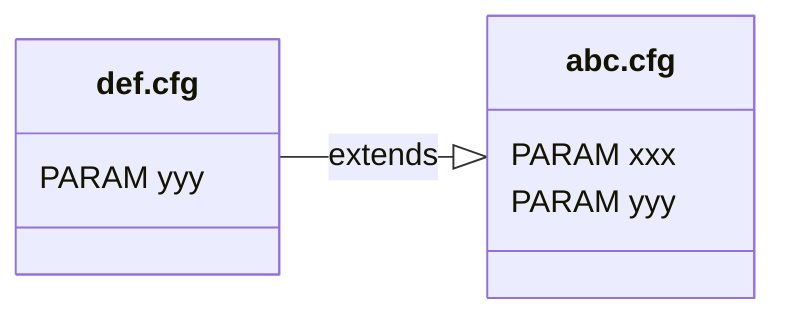

Here is a how the Config-Files relate:

```mermaid
classDiagram
  direction RL
  class abc["abc.cfg"]{
      PARAM xxx
      PARAM yyy
  }

  class def["def.cfg"]{
      PARAM yyy
  }

  abc <|-- def : extends

```
